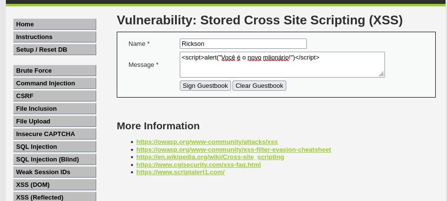
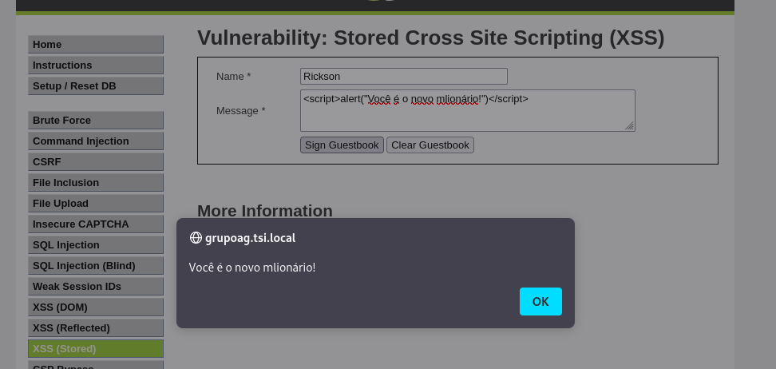
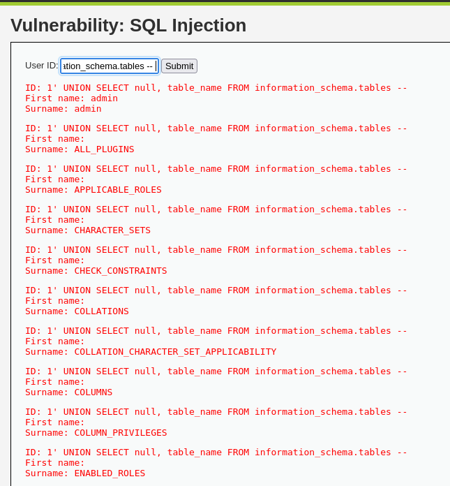
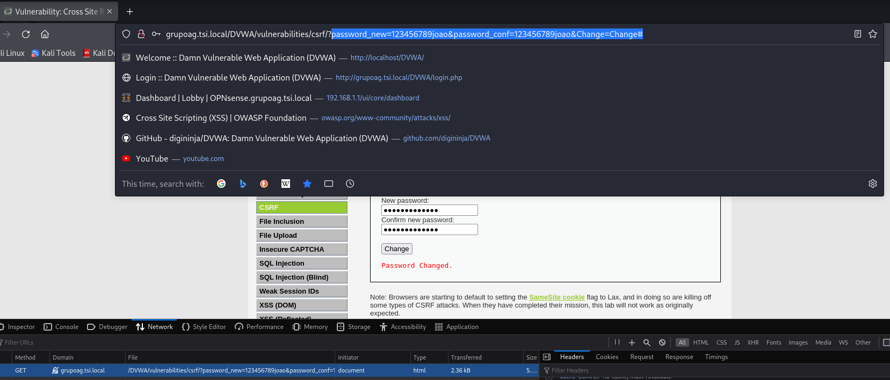

# Relatório técnico do Uso da DVWA para análise de vulnerabilidades e mitigação de ataques

### :teacher: Prof. Dr. Diego da Silva Pereira
#### :busts_in_silhouette: João Lucas e Rickson Rocha
#### :book: Segurança e preservação de dados
:pencil2: Curso de Sistemas para Internet

---

# O que é a DVWA? :thinking:

- **Damn Vulnerable Web Application (DVWA):** O Damn Vulnerable Web Application é um projeto de software que inclui intencionalmente vulnerabilidades de segurança e destina-se a fins educacionais.

- **Objetivo:** Permitir que profissionais de segurança aprendam e pratiquem técnicas de exploração e mitigação de vulnerabilidades.

---

# Por que Utilizar a DVWA? :clipboard:

- **Ambiente Controlado:** Seguro para testes e experimentos.
- **Diversidade de Vulnerabilidades:** Inclui falhas como SQL Injection, XSS, CSRF e muito mais.
- **Níveis de Dificuldade:** Configurações de segurança (Low, Medium, High, Impossible) para diferentes níveis de aprendizado.

---

# Vulnerabilidades analisadas

- **SQL Injection:** Exploração de falhas em consultas SQL para acesso não autorizado a bancos de dados.

- **Cross-Site Scripting (XSS):** Injeção de scripts maliciosos em páginas web.
- **Cross-Site Request Forgery (CSRF):** Execução de ações indesejadas em nome de um usuário autenticado.

---

# XSS Stored - Parte 1

---

# XSS Stored - Parte 2

---

# SQL injection

---

# CSRF

---

# Estratégias de Mitigação

- **SQL Injection:** Uso de consultas parametrizadas e validação de entradas.

- **XSS:** Sanitização de dados.
- **CSRF:** Utilização de tokens anti-CSRF em formulários.

---

# Conclusão

- A DVWA é uma ferramenta essencial para o aprendizado prático de segurança em aplicações web.
- A análise de vulnerabilidades como SQL Injection, XSS e CSRF reforça a importância de boas práticas de desenvolvimento.
- A implementação de estratégias de mitigação é crucial para proteger aplicações contra ataques.

---

# Obrigado! :kissing_heart:

📧 joao.crescencio@escolar.ifrn.edu.br  
📧 rickson.rocha@escolar.ifrn.edu.br  